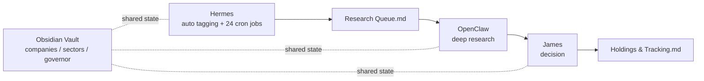
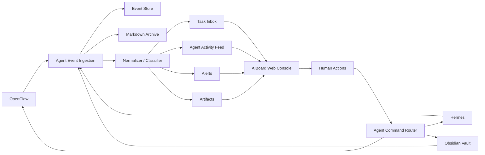
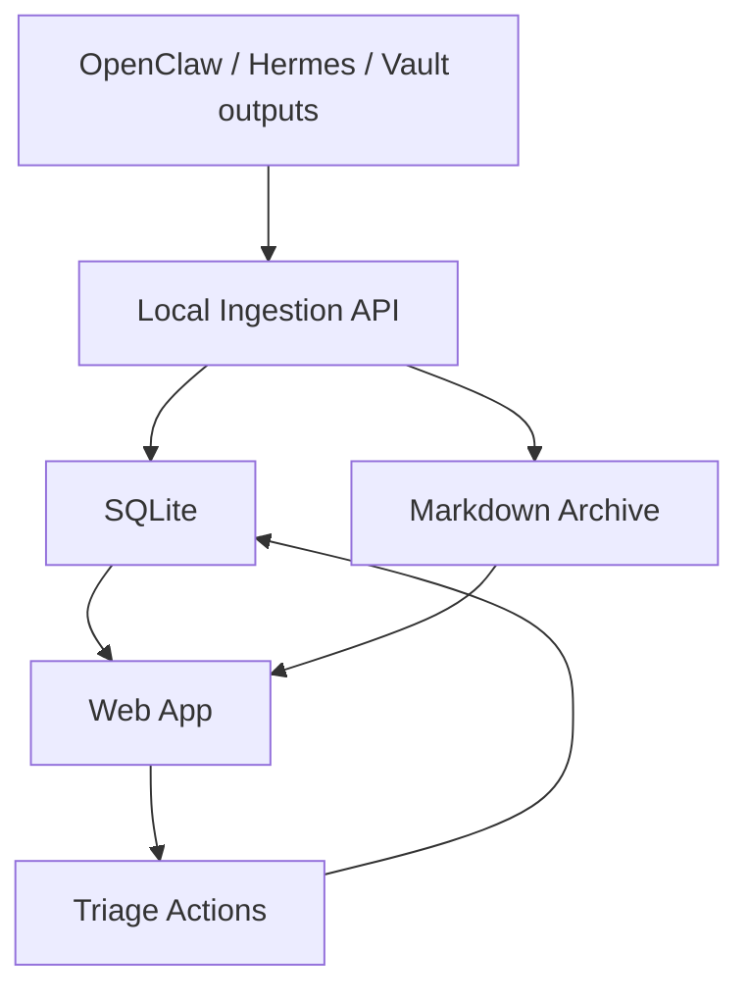

# AIBoard Architecture

## Problem

OpenClaw and Hermes can generate useful work, but their output becomes hard to process when it lands as high-volume logs, terminal output, files, or chat-like message streams. Raw output is poor for triage, status tracking, artifact review, and next actions.

AIBoard should convert agent output into a web-based operating layer.

## Existing Collaboration Model

One-line positioning:

- OpenClaw is the ecosystem coordinator: broad platform integration, automation, scheduling, and collaboration. It can do many things, but benefits from explicit human direction.
- Hermes is the self-evolving intelligence layer: focused on one thing at a time, stronger at long-term memory, continuous learning, and coherent multi-step reasoning.

Division of responsibility:

| Dimension | OpenClaw | Hermes |
| --- | --- | --- |
| Role | Multi-bot pipelines and automation scheduling | Long-term memory and coherent reasoning |
| Strength | Platform integration, skill ecosystem, scheduled tasks | Knowledge accumulation, self-improvement, multi-step reasoning |
| Weakness | Fragmented memory | Fewer platform integrations, fewer skills, weaker multi-bot orchestration |

Current research workflow:



Current roles in the vault workflow:

- Hermes runs broad and scheduled scanning: market scans, sector agents, functional pipelines, and governor routing.
- OpenClaw is manually triggered by James for single-company deep research.
- James is the human decision layer.
- The Obsidian Vault is the shared state layer across `companies/`, `sectors/`, and `governor/`.

AIBoard should not replace this model. It should sit above it as the operational review and action surface.

## High-Level Flow



## Core Concepts

### Agent Event

Every incoming item is normalized into an event before it appears in the UI.

```ts
type AgentEvent = {
  id: string
  source: "openclaw" | "hermes" | "vault" | "manual"
  timestamp: string
  threadId?: string
  workflowId?: string
  actor: string
  type: "status" | "finding" | "task" | "question" | "alert" | "artifact" | "decision" | "research_queue" | "tracking_update"
  priority: "low" | "normal" | "high" | "urgent"
  title: string
  summary: string
  rawContent: string
  markdownPath?: string
  vaultPath?: string
  suggestedActions: AgentAction[]
  status: "new" | "triaged" | "in_progress" | "done" | "archived"
  tags: string[]
}
```

### Agent Action

Actions are the bridge between passive reading and active control.

```ts
type AgentAction = {
  id: string
  label: string
  kind: "approve" | "reply" | "assign" | "archive" | "open_artifact" | "ask_follow_up"
  target?: "openclaw" | "hermes" | "vault"
  payload?: Record<string, unknown>
}
```

### Agent Command

When the human takes an action, AIBoard creates a command that can be routed back to an agent or channel.

```ts
type AgentCommand = {
  id: string
  target: "openclaw" | "hermes" | "vault"
  commandType: "reply" | "approve" | "run_task" | "clarify" | "cancel" | "update_vault"
  payload: Record<string, unknown>
  createdBy: "human" | "system"
  relatedEventId: string
  createdAt: string
}
```

## Proposed MVP Architecture



## Components

### 1. Ingestion API

Receives events from local agents or adapters.

Initial input paths:

- HTTP webhook on localhost
- Local file drop directory
- Manual JSON import
- Obsidian Vault file watcher

Responsibilities:

- Accept raw messages
- Stamp source and timestamp
- Persist raw content
- Queue normalization

### 2. Normalizer

Converts noisy output into structured, reviewable events.

Responsibilities:

- Generate short title
- Produce summary
- Classify event type
- Estimate priority
- Extract artifact references
- Suggest next actions
- Link related messages into a thread

The normalizer can start rule-based and become AI-assisted later.

### 3. Event Store

SQLite is enough for the first version.

Suggested tables:

- `events`
- `threads`
- `actions`
- `commands`
- `artifacts`
- `agents`

### 4. Markdown Archive

Every accepted agent output should also be preserved as a local Markdown file. SQLite is optimized for UI state and queries; Markdown is optimized for human-readable history, portability, review, and backup.

Recommended folder structure:

```text
agent-output/
  2026-05-20/
    openclaw/
      2026-05-20T143022Z-repository-scan.md
    hermes/
      2026-05-20T143145Z-market-summary.md
```

Recommended Markdown frontmatter:

```md
---
id: evt_01HX...
source: openclaw
actor: OpenClaw
type: finding
priority: normal
status: new
createdAt: 2026-05-20T14:30:22Z
threadId: th_01HX...
tags:
  - repository
  - scan
---

# Repository scan completed

Short summary generated for the web console.

## Raw Output

Original agent output goes here.

## Suggested Actions

- Review candidate files
- Archive if no action is needed
```

Write policy:

- Write one Markdown file per normalized event.
- Store raw output in the Markdown file even when the UI shows only a summary.
- Keep the Markdown path on the event record as `markdownPath`.
- Treat SQLite and Markdown as a synchronized pair, but SQLite remains the UI source of truth for mutable state.
- If a user action changes status, update SQLite immediately and optionally append an audit note to the Markdown file.

### 5. Web Console

The first screen should be a work surface, not a landing page.

Primary views:

- `Now`: items requiring human attention
- `Activity`: compressed agent stream
- `Artifacts`: generated files and reports
- `Research Queue`: items from `研究队列.md`
- `Tracking`: holdings, watchlist, and follow-up updates
- `History`: searchable archive

### 6. Command Router

Turns human actions into structured commands for OpenClaw, Hermes, or the vault.

The router should start conservative:

- Record commands locally first
- Require explicit human approval for outbound side effects
- Add adapters one by one

## UI Direction

AIBoard should feel like an operations console:

- Dense but calm
- Minimal charts
- Strong status labels
- Fast triage controls
- Collapsed noise by default
- Raw content available on demand

First screen sketch:

```text
AIBoard

[Need Attention 5] [Research Queue 8] [Running 3] [Artifacts 12] [Tracking 6]

NOW
- Hermes flagged a company for review
- OpenClaw completed deep research

AGENT ACTIVITY
Hermes     market scan completed
OpenClaw   deep research ready for James

ARTIFACTS
- Market brief
- Company research note
- Holdings update
```

## Implementation Recommendation

Start simple:

- Frontend: Vite + React
- Backend: Node.js + Fastify or Express
- Database: SQLite
- Realtime: polling first, WebSocket later
- Styling: local CSS or lightweight component primitives

Do not introduce a queue, vector database, or complex auth until the basic event loop is useful.

## Open Questions

- How do OpenClaw and Hermes currently emit output: files, HTTP, CLI logs, or another local channel?
- Where is the Obsidian Vault located on disk, and which files should AIBoard watch first?
- Does AIBoard need to send commands back to agents in the first version, or only display and triage?
- What artifacts should be opened directly in the browser: markdown, screenshots, PDFs, code diffs, JSON?
