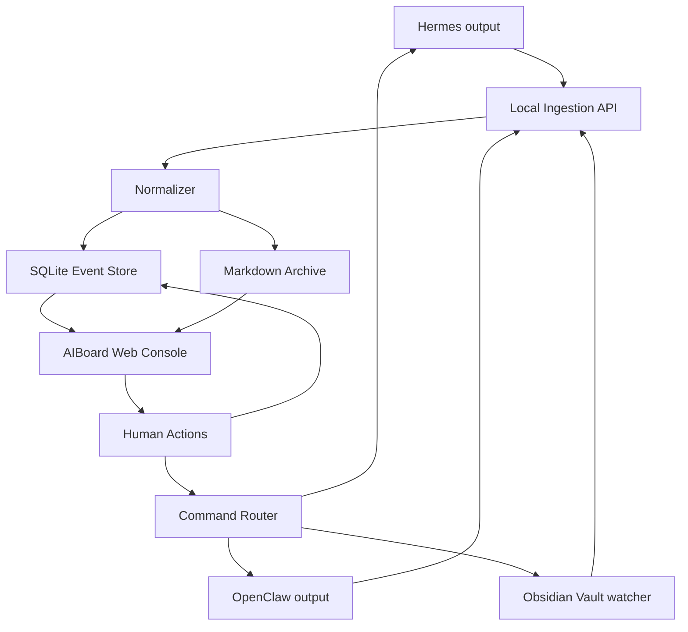

# AIBoard Project Plan

## 1. Product Definition

AIBoard is a local web console for reviewing, triaging, archiving, and acting on output from the existing Hermes + OpenClaw + Obsidian Vault workflow.

It is not a general analytics dashboard and not a chat replacement. It is an operations surface for agent collaboration.

Existing workflow:

```text
Hermes
  broad scheduled scanning, auto tagging, memory, self-improvement
    -> Research Queue.md

OpenClaw
  human-directed deep research and ecosystem coordination
    -> James decision

James
  human decision layer
    -> Holdings & Tracking.md

Obsidian Vault
  shared state across companies, sectors, governor, queue, tracking
```

AIBoard sits above this workflow and makes it easier to see what needs attention, inspect agent output, preserve records, and trigger the next step.

## 2. MVP Goal

Build a local-first working prototype that can:

- Accept OpenClaw / Hermes / Vault events
- Normalize raw agent output into structured events
- Store events in SQLite
- Write every agent output into local Markdown files
- Display a concise web console
- Let James triage, archive, mark done, open Markdown, and review artifacts
- Track research queue and holdings/tracking updates

## 3. Explicit Non-Goals For MVP

Do not build these in the first version:

- Telegram integration
- Multi-user auth
- Cloud sync
- Complex chart dashboard
- Fully automated trading or investment decisions
- Autonomous irreversible command execution
- Full Obsidian replacement
- Vector database or RAG layer

## 4. System Architecture



## 5. Core Modules

### 5.1 Ingestion API

Purpose: receive raw output from agents and local files.

Initial inputs:

- `POST /api/events`
- `POST /api/import`
- Local drop folder, for example `inbox/`
- Later: file watcher for selected Vault files

Responsibilities:

- Validate incoming payload
- Stamp `receivedAt`
- Preserve raw content
- Call normalizer
- Persist event
- Write Markdown archive file

### 5.2 Normalizer

Purpose: convert noisy agent output into concise, actionable events.

MVP implementation can be rule-based:

- Use source to infer actor
- Extract first heading or first line as title
- Generate summary from first meaningful paragraph
- Infer event type from keywords and file path
- Assign default priority
- Suggest basic actions

Later it can become AI-assisted.

### 5.3 SQLite Event Store

Purpose: queryable UI state.

Core tables:

- `events`
- `actions`
- `commands`
- `artifacts`
- `agents`
- `threads`

SQLite is the source of truth for mutable state such as `status`, `priority`, and action history.

### 5.4 Markdown Archive

Purpose: durable, human-readable record of agent output.

Recommended structure:

```text
agent-output/
  YYYY-MM-DD/
    hermes/
    openclaw/
    vault/
```

Each event writes one Markdown file with frontmatter:

```md
---
id: evt_xxx
source: hermes
actor: Hermes
type: finding
priority: normal
status: new
createdAt: 2026-05-20T14:30:22Z
threadId: th_xxx
workflowId: research_xxx
vaultPath: companies/example.md
---

# Event Title

Summary for the web console.

## Raw Output

Original agent output.

## Suggested Actions

- Review
- Archive
```

### 5.5 Web Console

Purpose: turn agent output into a small number of reviewable work surfaces.

Primary views:

- `Now`: needs attention
- `Research Queue`: candidates and pending research
- `Activity`: compressed OpenClaw / Hermes activity
- `Artifacts`: generated research notes, files, summaries
- `Tracking`: holdings and follow-up updates
- `History`: searchable archive

Primary interactions:

- Open event
- Open Markdown file
- Mark triaged
- Mark done
- Archive
- Assign to OpenClaw
- Ask Hermes follow-up
- Create vault update command

### 5.6 Command Router

Purpose: record and later dispatch human-approved commands.

MVP behavior:

- Record commands locally
- Do not execute risky outbound actions automatically
- Support draft commands before real agent adapters exist

Example commands:

- Run OpenClaw deep research on company
- Ask Hermes to rescan a sector
- Update `持仓与跟踪.md`
- Append decision note to vault

## 6. Data Model Draft

```ts
type AgentSource = "hermes" | "openclaw" | "vault" | "manual"

type EventType =
  | "status"
  | "finding"
  | "task"
  | "question"
  | "alert"
  | "artifact"
  | "decision"
  | "research_queue"
  | "tracking_update"

type EventStatus =
  | "new"
  | "triaged"
  | "in_progress"
  | "done"
  | "archived"

type AgentEvent = {
  id: string
  source: AgentSource
  actor: string
  type: EventType
  status: EventStatus
  priority: "low" | "normal" | "high" | "urgent"
  title: string
  summary: string
  rawContent: string
  markdownPath?: string
  vaultPath?: string
  threadId?: string
  workflowId?: string
  tags: string[]
  createdAt: string
  updatedAt: string
}
```

## 7. Suggested Repository Structure

```text
AIBoard/
  README.md
  docs/
    ARCHITECTURE.md
    PROJECT_PLAN.md
  apps/
    web/
      src/
      package.json
    server/
      src/
      package.json
  packages/
    shared/
      src/
  data/
    .gitkeep
  agent-output/
    .gitkeep
  inbox/
    .gitkeep
```

If we want the fastest MVP, we can also start as a single Node project and split later:

```text
AIBoard/
  src/
    server/
    web/
    shared/
```

Recommendation: use the monorepo-style `apps/` + `packages/` structure because this project will naturally have frontend, backend, shared types, and adapters.

## 8. Development Phases

### Phase 0: Static UI Prototype

Estimated time: 0.5-1 day.

Deliverables:

- Vite React app
- Mock event data
- Main console layout
- Event detail panel
- Basic views: Now, Activity, Artifacts, Research Queue, Tracking

Goal: confirm the UI shape before backend work.

### Phase 1: Local Event Store

Estimated time: 1-2 days.

Deliverables:

- Node/Fastify server
- SQLite schema
- CRUD API for events
- Event status updates
- Basic search/filter
- Seed data

Goal: make UI state persistent.

### Phase 2: Markdown Archive

Estimated time: 0.5-1 day.

Deliverables:

- Markdown writer
- Frontmatter format
- `agent-output/YYYY-MM-DD/source/*.md`
- `markdownPath` stored on event
- UI link to local Markdown archive entry

Goal: every agent output is preserved outside the web app.

### Phase 3: Ingestion MVP

Estimated time: 1-2 days.

Deliverables:

- `POST /api/events`
- Manual JSON import
- Local `inbox/` file import
- Rule-based normalizer
- Source-specific defaults for Hermes, OpenClaw, Vault

Status: implemented.

Supported inbox files:

- `.md`
- `.markdown`
- `.txt`
- `.json`

Import behavior:

- Scan `inbox/` on startup
- Poll `inbox/` while the server is running
- Trigger manually with `POST /api/import/inbox`
- Move successful imports to `inbox/processed/`
- Move failed imports to `inbox/failed/`
- Record import status in `imported_files`

Goal: real agent outputs can enter AIBoard.

### Phase 4: Vault Awareness

Estimated time: 1-2 days.

Deliverables:

- Configurable Vault path
- Watch selected files or folders
- Parse `研究队列.md`
- Parse `持仓与跟踪.md`
- Create events from queue/tracking changes

Status: implemented as read-only Vault import.

Implemented behavior:

- Config file at `config/aiboard.config.json`
- Optional local override at `config/aiboard.config.local.json`
- Manual import with `npm run import:vault`
- API import with `POST /api/import/vault`
- UI button: `Import Vault`
- Automatic polling while the server runs
- Watches selected Markdown files and folders
- Uses `vault_snapshots` with content hashes to prevent duplicate unchanged imports
- Stores `vaultPath` on generated events

Goal: connect AIBoard to the actual research workflow.

### Phase 5: Command Drafting

Estimated time: 1-2 days.

Deliverables:

- Command table
- Draft command UI
- Assign to OpenClaw / Ask Hermes actions
- Vault update command drafts
- Manual copy/export for commands

Status: implemented for local draft creation.

Implemented behavior:

- `commands` table is active
- `GET /api/commands`
- `POST /api/commands`
- `PATCH /api/commands/:id/status`
- Suggested action buttons create command drafts
- Event detail shows commands related to the selected event
- Lower panel shows all draft commands
- Draft command count appears in top stats
- Draft creation appends an audit note to the event Markdown archive

Goal: support next-action workflows without unsafe automation.

### Phase 6: Real Agent Adapters

Estimated time: depends on OpenClaw/Hermes interfaces.

Deliverables:

- OpenClaw adapter
- Hermes adapter
- Command execution with confirmation
- Audit log

Phase 6A status: implemented local command outbox.

Implemented behavior:

- `POST /api/commands/:id/dispatch`
- Dispatching a draft command writes `.json` and `.md` files to `command-outbox/{target}/`
- Command status changes from `draft` to `dispatched`
- Dispatch appends an audit note to the event Markdown archive
- UI `Command Drafts` panel has a `Dispatch` button

Phase 6B status: implemented local CLI adapters.

Implemented behavior:

- `npm run adapters:run`
- `POST /api/adapters/run`
- Hermes command execution through `hermes chat`
- OpenClaw command execution through `openclaw agent --agent main`
- Command lifecycle: `dispatched -> running -> completed/failed`
- Agent CLI output is written back as new AIBoard events
- Agent output is archived into Markdown
- Hermes smoke test passed
- OpenClaw smoke test passed

Goal: close the loop from output -> review -> action.

## 9. First Build Recommendation

Start with Phase 0 + Phase 1 + Phase 2.

That gives a useful local product quickly:

```text
Mock/ingested events
  -> SQLite
  -> Markdown archive
  -> Web console
  -> triage actions
```

Then connect the real Hermes/OpenClaw/Vault paths once the interface feels right.

## 10. Immediate Decisions Needed

Before implementation, decide:

- Exact Obsidian Vault path on disk
- Exact names/paths of `研究队列.md` and `持仓与跟踪.md`
- Whether OpenClaw/Hermes can emit HTTP events, files, or both
- Whether AIBoard should be local-only or LAN-accessible
- Whether Markdown archive should live inside this repo or beside the Vault

Recommended defaults:

- Start local-only
- Store AIBoard-generated Markdown in `agent-output/`
- Watch Vault read-only at first
- Record command drafts before executing them
